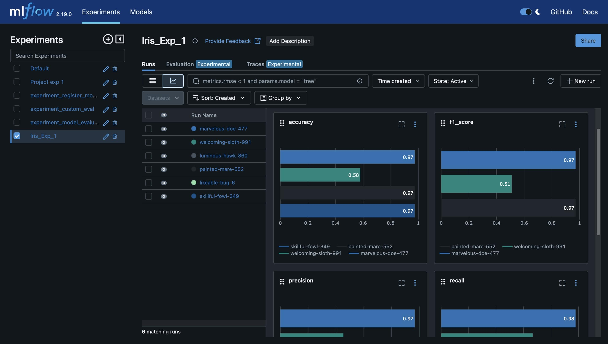
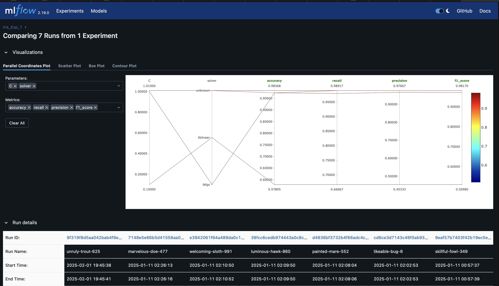

# MLflow-Logging-Tracking
This repository demonstrates using MLflow for managing and tracking ML experiments. It includes setting up and executing a Logistic Regression model, with detailed tracking of parameters and metrics. Ideal for those interested in MLflow for enhancing model management and reproducibility.



### Problem Statement
In the realm of machine learning, managing and tracking experiments efficiently remains a significant challenge, particularly when dealing with multiple model iterations and configurations. This project addresses the need for a systematic approach to log, compare, and analyze machine learning experiments, using MLflow. The objective is to demonstrate the setup and execution of a logistic regression model, leveraging MLflow's capabilities to provide comprehensive tracking of model parameters, performance metrics, and experiment artifacts, thereby enhancing reproducibility and streamlining the management of machine learning workflows.

### Environment Setup

Create a virtual environment and activate it:

```bash
conda create -p venv python=3.10
conda activate venv/
```

### Install Dependencies

Install the required Python libraries specified in `requirements.txt` (also referred to as `re.txt`):

```bash
pip install -r requirements.txt
```

###  Importing Libraries

```bash
import logging
import pandas as pd
from sklearn.model_selection import train_test_split
from sklearn.linear_model import LogisticRegression
from sklearn import metrics
import mlflow
import mlflow.sklearn
from pathlib import Path
import os
import argparse
```
- <ins>**mlflow:</ins>** An open-source platform for managing the end-to-end machine learning lifecycle. It includes tracking experiments to record and compare parameters and results.
  
- <ins>**mlflow.sklearn:**</ins> This module is part of MLflow and is specifically designed to provide utilities to log, load, and serve scikit-learn models using MLflow.
  
- <ins>**pathlib.Path:**</ins> This class in the pathlib module offers classes representing filesystem paths with semantics appropriate for different operating systems. It provides methods to perform tasks related to file paths (like joining paths, reading files, etc.).
  
- <ins>**os:**</ins> Provides a way of using operating system-dependent functionality like reading or writing to a file, manipulating paths, etc.
  
- <ins>**argparse:**</ins> This module makes it easy to write user-friendly command-line interfaces. The program defines what arguments it requires, and argparse will figure out how to parse those out of sys.argv.
  
- <ins>**logging:**</ins> Provides a flexible framework for emitting log messages from Python programs. It is used to track events that happen when some software runs.
  
- <ins>**pandas:**</ins> An open-source library providing high-performance, easy-to-use data structures and data analysis tools for the Python programming language. It is especially good at handling tabular data.
  
- <ins>**sklearn.model_selection.train_test_split:**</ins> Part of the scikit-learn library, this function is used to split datasets into random train and test subsets, which is helpful for evaluating the performance of machine learning models.
  
- <ins>**sklearn.linear_model.LogisticRegression:**</ins> Also from the scikit-learn library, this module is used to perform logistic regression, a statistical method for analyzing a dataset in which there are one or more independent variables that determine an outcome.
  
- <ins>**sklearn.metrics:**</ins> This module includes score functions, performance metrics, and pairwise metrics and distance computations. It is used to assess the accuracy of models.

### Data Loading and Preparation
This section details how the Iris dataset is loaded, how features and labels are prepared, and how the data is subsequently split into training and testing sets to ensure reproducibility and effective model evaluation.

The Iris dataset is loaded from a CSV file using the Pandas library. The dataset consists of 150 records of iris flowers, each described by four features (sepal length, sepal width, petal length, and petal width) and categorized into one of three varieties.

```bash
import pandas as pd
df = pd.read_csv('/path/to/iris.csv')
```
We separate the dataset into features (X) and labels (Y). The features include the measurements of the flowers, while the labels denote the variety of each iris.

```bash
X = df.iloc[:,0:4]  # Features: sepal length, sepal width, petal length, petal width
Y = df['variety']   # Labels: Iris variety
```

To evaluate the model's performance accurately on unseen data, we split the dataset into training and testing sets using scikit-learn's train_test_split function. We specify a test size of 25% and set the random_state to 0 to ensure the split is consistent across different runs.

```bash
from sklearn.model_selection import train_test_split
X_train, X_test, Y_train, Y_test = train_test_split(X, Y, test_size=0.25, random_state=0)
```
### MLflow Configuration

In this project, MLflow is utilized to streamline the management and tracking of machine learning experiments. This section details the configuration of MLflow for centralized tracking of model parameters, metrics, and artifacts, ensuring robust experiment reproducibility and comparability.

Setting the Tracking URI

MLflow uses a tracking URI to store all the experiment metrics, parameters, and outputs. This URI points to the directory where all MLflow tracking information is saved. Setting this URI allows all project runs to be consolidated in a single location, simplifying the process of performance evaluation and version control.

```bash
import mlflow
mlflow.set_tracking_uri("file:///path/to/mlruns")
```
Starting an MLflow Experiment

Before any run can be tracked, an experiment must be defined or set in MLflow. By setting an experiment, MLflow organizes runs under named experiments, which is very useful for categorizing different phases or types of model training. Here, we create or set an experiment named Iris_Exp_1.

```bash
exp = mlflow.set_experiment(experiment_name='Iris_Exp_1')
```
Once the experiment is set, you start an MLflow run using mlflow.start_run(). This function initiates the tracking of parameters, metrics, and artifacts for that specific run. Each run is logged with a unique identifier, allowing for detailed analysis and comparison of different runs within the same experiment.

```bash
mlflow.start_run()
```

### Model Training

In this section, we detail the configuration and training of the Logistic Regression model for our Iris dataset and describe how MLflow is used to log the model parameters and metrics to facilitate a thorough examination and reproducibility of the experiment results.

Configuring the Logistic Regression Model

The Logistic Regression model is configured with specific hyperparameters that control its behavior and performance. We use scikit-learn's LogisticRegression class to create the model. The parameters include penalty for regularization type, C as the inverse of regularization strength, random_state to ensure reproducibility, solver for the optimization algorithm, and max_iter for the maximum number of iterations.

```bash
from sklearn.linear_model import LogisticRegression
log = LogisticRegression(penalty=penalty, C=C, random_state=42, solver=solver, max_iter=max_iter)
```
Training the Model
Once the model is configured, it is trained on the training dataset. This involves fitting the model to the data using fit() method, which learns the model parameters to best predict the class labels.

```bash
log.fit(X_train, Y_train)
```

After the model is trained, it is used to make predictions on the test dataset. We predict the class labels for the test set using the predict() method of the model.

```bash
prediction = log.predict(X_test)
```

### Logging Hyperparameters and Model

To maintain comprehensive records and ensure reproducibility of the model training process, it's crucial to log the model's hyperparameters and the model itself using MLflow. This section will detail how to do so effectively.

The hyperparameters for the Logistic Regression model are defined in a dictionary. This structured approach not only organizes the parameters but also facilitates their logging in MLflow. By logging these parameters, we can track the configuration of each model run, making it easy to replicate results or iterate on the model configuration.

```bash
params = {
    'C': C,
    'solver': solver,
    'penalty': penalty,
    'max_iter': max_iter,
}
mlflow.log_params(params)
```

After training the model, it is essential to log it to MLflow. This allows the model, along with its parameters, to be saved in an MLflow tracking environment. Logging the model enables us to version the model, compare it against other models, and potentially deploy it for production or further testing.

```bash
import mlflow.sklearn
mlflow.sklearn.log_model(log, "Logistic Regression")
```

### Calculating and Logging Performance Metrics

After training the Logistic Regression model and making predictions, it is essential to evaluate the model's performance using various metrics. This section describes how to calculate these metrics and log them using MLflow, which aids in assessing the model's effectiveness.

Calculating Metrics

We calculate several key performance metrics, including accuracy, precision, recall, and the F1 score. These metrics provide a comprehensive view of the model's performance across various aspects:

```bash
from sklearn import metrics
accuracy = metrics.accuracy_score(Y_test, prediction)
precision = metrics.precision_score(Y_test, prediction, average='macro')
recall = metrics.recall_score(Y_test, prediction, average='macro')
f1_score = metrics.f1_score(Y_test, prediction, average='macro')

evaluation_metrics = {
    'accuracy': accuracy,
    'precision': precision,
    'recall': recall,
    'f1_score': f1_score,
    # 'auc': auc, # Uncomment if ROC AUC score is logged
}

mlflow.log_metrics(evaluation_metrics)

```

### Logging Model, Artifacts, and Metrics, and Ending the Run

After evaluating the model with various performance metrics, it's important to log the model, any related artifacts, the calculated metrics, and properly conclude the MLflow run. This ensures all components of the experiment are captured and tracked.

The trained Logistic Regression model is logged in MLflow. This captures the model along with its configuration and allows for later deployment or further analysis:

```bash
mlflow.sklearn.log_model(log, "Logistic Regression")
```

If there are additional files such as plots, data subsets, or configuration files stored in the data/ directory, they can be logged as artifacts. This step is crucial for preserving outputs that could be necessary for report generation or audit trails:

```bash
mlflow.log_artifacts('data/')
```

The performance metrics calculated earlier are logged to MLflow. This creates a permanent record of how well the model performed according to these metrics:

```bash
mlflow.log_metrics(evaluation_metrics)
```

Once all relevant data has been logged, end the MLflow run to close out this experiment session:

```bash
mlflow.end_run()
```


Output the Results

Finally, output the performance metrics to the console, providing immediate feedback on model performance:

```bash
print('The accuracy of the Logistic Regression is ', accuracy)
print('The precision of the Logistic Regression is ', precision)
print('The recall of the Logistic Regression is ', recall)
print('The f1_score of the Logistic Regression is ', f1_score)
```


